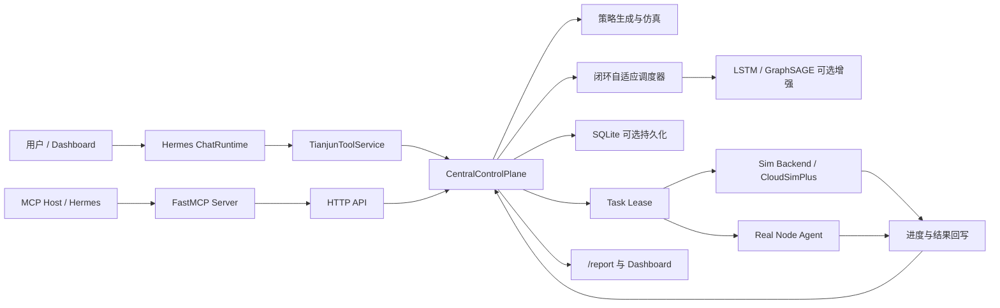
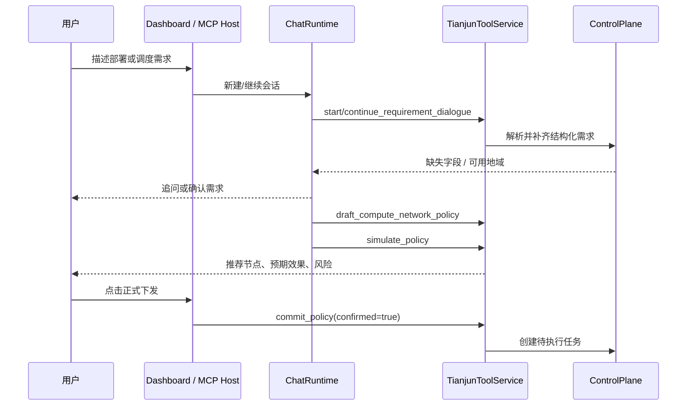

# Tianjun Engine | 天钧算力网络资源调度智能体

天钧（Tianjun Engine）是一个面向算力网络资源编排的本地可运行原型系统。它把自然语言需求理解、可解释策略生成、确定性多目标调度、可选机器学习增强、仿真/真实节点执行回传和可视化监控组织成一条闭环链路。

用户可以用自然语言描述任务，例如“在上海部署一个低时延推理任务，2 核 4 GB 内存，不需要 GPU”，由 Hermes 智能体澄清需求、生成策略、执行仿真并等待用户明确确认；控制面随后才会创建任务、发放 lease，并接收节点执行反馈以更新后续调度权重。

> 当前定位：本项目是研究与演示性质的算力调度控制面，不是可直接承载生产业务的云平台。节点、价格和执行结果只来自已注册节点、仿真后端或外部系统上报，智能体不会凭空生成资源事实。

## 项目价值

传统资源调度 Demo 往往只展示“任务分配给哪个节点”。天钧关注更完整的问题：

- 用自然语言把业务诉求转换为结构化的算力、网络、预算与安全约束。
- 在选点之前进行需求澄清、候选预演、风险解释和人工确认。
- 同时考虑计算资源、网络传输、成本、可靠性、负载均衡、局部性和安全约束。
- 支持 CloudSimPlus、内置模拟节点运行时和真实节点 Agent 接入同一控制面。
- 将执行结果回写为调度反馈，使策略权重随 SLA、失败率、成本和网络压力调整。
- 通过 MCP 把相同能力开放给 Hermes 或其他支持工具调用的智能体宿主。

## 核心能力

| 能力 | 实现说明 |
| --- | --- |
| Hermes 对话调度 | 多轮澄清需求，生成策略、仿真、解释、反馈优化和确认后提交 |
| 确定性选点 | 基于九项指标的可审计归一化加权评分，不将最终状态迁移交给 LLM |
| 模型增强 | 可加载 LSTM 时延模型与 GraphSAGE 风格拓扑稳定性模型；未安装 PyTorch 时自动降级 |
| 控制面 API | 标准库 `ThreadingHTTPServer` 提供节点、任务、策略、聊天、lease 与执行结果接口 |
| Dashboard | 单页控制台展示节点、任务、策略、模型状态、评分权重、最近决策与智能体会话 |
| 执行闭环 | 支持 `noop`、本地进程、Docker、Kubernetes Job 和配置驱动仿真模式 |
| 外部仿真接入 | 为 CloudSimPlus 保留 `/schedule/preview` 与 `/schedule/commit` 兼容接口 |
| MCP 工具服务 | 基于可选依赖 FastMCP，将当前已注册的 13 个控制面/会话工具以 stdio MCP server 暴露 |
| 状态持久化 | 可选 SQLite 存储节点、任务、租约、决策、执行记录和策略调整历史 |

## 系统架构



### 设计边界

- LLM 可以辅助理解意图和生成自然语言解释，但库存事实、策略状态变更和任务提交只由控制面工具执行。
- Hermes 路径中的 `commit_policy` 与 `schedule_pending_task` 必须有显式用户确认；Dashboard 使用独立的“正式下发”动作完成提交。
- CloudSimPlus 的 `/schedule/commit` 是面向外部仿真桥接的直接提交接口，不经过 Hermes 人工确认流程。
- `serve --inventory` 仅校验库存配置文件，不会自动把模拟节点注册在线；节点必须由 `sim-backend`、CloudSimPlus 或真实 Agent 注册/心跳上报。

## 技术栈

| 层次 | 技术 / 模块 | 用途 |
| --- | --- | --- |
| 语言与打包 | Python `>=3.10`、`setuptools`、`pyproject.toml` | 核心工程与 CLI 打包 |
| HTTP 服务 | Python 标准库 `http.server.ThreadingHTTPServer` | REST/SSE 接口与 Dashboard 服务 |
| 前端界面 | 原生 HTML / CSS / JavaScript | 无构建依赖的本地监控与对话页面 |
| 智能体编排 | `ChatRuntime`、`TianjunToolService` | Hermes 风格的受控对话工作流 |
| LLM 接入 | OpenAI-compatible Chat Completions；示例配置使用 DeepSeek | 需求状态追踪与回复辅助 |
| 工具协议 | FastMCP（可选） | 对外提供 MCP stdio 工具服务 |
| 调度内核 | 自研 `ClosedLoopAdaptiveScheduler` | 多目标约束过滤、评分与选点 |
| ML 运行时 | PyTorch（可选） | LSTM 时延预测、GraphSAGE 稳定性评分 |
| 仿真与执行 | 配置驱动 Simulator、CloudSimPlus 兼容 HTTP、Process/Docker/Kubernetes 执行器 | 任务执行与结果反馈 |
| 存储 | SQLite（可选） | 控制面状态与调度历史持久化 |
| 测试依赖 | pytest（可选开发依赖） | 后续自动化验证入口 |

## 目录结构

```text
tianjun-optimize/
├─ main.py                         # 无需安装即可运行的 CLI 入口
├─ pyproject.toml                  # 包元数据、可选依赖和 console scripts
├─ requirements.txt                # 最小开发/验证依赖
├─ start_tianjun.bat               # Windows 启动完整演示闭环并打开 Dashboard
├─ restart_tianjun.bat             # Windows 安全重启控制面与模拟节点后端
├─ configs/
│  ├─ tianjun.example.toml         # 服务、LLM、MCP、执行安全配置模板
│  └─ sim_cluster.example.json     # 模拟节点、链路与工作负载画像
├─ data/trained_models/            # 已训练模型、manifest 和训练报告
└─ src/tianjun/
   ├─ application/                 # 中央控制面和应用组装
   ├─ chat/                        # Hermes 对话运行时与 SSE 工具轨迹
   ├─ core/                        # 用户需求、算网策略与效果对象
   ├─ domain/                      # 节点、任务、网络、执行、决策等领域模型
   ├─ scheduling/                  # 确定性多目标调度引擎
   ├─ policy/                      # 解析、澄清、策略生成、仿真、反馈优化
   ├─ ml/                          # 模型加载、预测与分布漂移保护
   ├─ tools/                       # Dashboard/Hermes/MCP 共用工具契约
   ├─ integrations/                # MCP 服务适配层
   ├─ interfaces/                  # HTTP 服务与 Dashboard 页面
   │  └─ dashboard/static/         # Dashboard 静态页面唯一源
   ├─ simulation/                  # 配置驱动模拟节点运行时
   ├─ node_agent/                  # 轻量 Agent 与真实节点探测 Agent
   ├─ execution/                   # 执行器注册表和运行后端
   ├─ inventory/                   # 节点与网络库存加载
   ├─ storage/                     # SQLite 状态存储
   ├─ llm/                         # OpenAI-compatible LLM 客户端
   └─ config/                      # 配置、路径、dotenv 与本地密钥读取
```

Dashboard 静态页面唯一源文件位于 `src/tianjun/interfaces/dashboard/static/dashboard.html`，由 `page.py` 直接读取返回。不存在内嵌回退版本，修改时只需编辑该文件。

## 快速开始

### 环境要求

- Python 3.10 或更高版本。
- Windows 用户可直接使用 `.bat` 脚本；其他平台使用 Python 命令启动。
- 仅运行控制面和确定性调度时不要求安装 PyTorch 或 FastMCP。
- 使用 DeepSeek/Hermes LLM 辅助时需要自行准备 API key，且禁止将 key 提交到 GitHub。

### 安装完整运行依赖

```powershell
python -m venv .venv
.\.venv\Scripts\Activate.ps1
python -m pip install --upgrade pip
python -m pip install -e ".[ml-runtime,mcp]"
```

如果只需要最小控制面，也可以安装基础包；开发验证再额外安装 `dev`：

```powershell
# 最小运行，不包含 PyTorch 模型增强和 MCP
python -m pip install -e .

# 开发验证
python -m pip install -e ".[dev]"
```

### 完整启动：Hermes + 模型增强 + Dashboard + 模拟节点

示例配置默认连接 OpenAI-compatible 的 DeepSeek 接口。推荐使用内置密钥命令写入用户配置目录；`${TIANJUN_CONFIG_DIR}` 默认解析到用户配置目录（Windows 通常为 `%APPDATA%\Tianjun`），不会落入仓库：

```powershell
python -B main.py secrets --config configs\tianjun.example.toml set deepseek --api-key "your_api_key_here"
python -B main.py llm-check --config configs\tianjun.example.toml
```

第一个终端启动控制面。完整模式不要加 `--offline`：

```powershell
python -B main.py serve `
  --config configs\tianjun.example.toml `
  --inventory configs\sim_cluster.example.json `
  --default-execution-mode simulation `
  --host 127.0.0.1 `
  --port 8024
```

第二个终端启动模拟节点运行时。它会读取示例库存中的 16 个节点，注册、发送心跳、领取 lease 并回写阶段进度与结果：

```powershell
python -B main.py sim-backend `
  --server http://127.0.0.1:8024 `
  --inventory configs\sim_cluster.example.json `
  --verbose
```

访问：

```text
http://127.0.0.1:8024/dashboard
```

Windows 下也可在配置好 API key 后双击 `start_tianjun.bat`。该脚本会先执行 LLM 连接检查，再启动控制面、模拟节点后端并打开 Dashboard。`restart_tianjun.bat` 会停止符合当前命令特征的 Tianjun 控制面与模拟后端后重新启动完整闭环。

完整启动后可用健康检查确认能力：

```powershell
Invoke-RestMethod http://127.0.0.1:8024/health
Invoke-RestMethod http://127.0.0.1:8024/report
```

期望状态：

- `/health` 中 `chat_runtime.llm.enabled` 为 `true`。
- `/health` 中 `model_runtime.status` 为 `loaded`，并加载 `lstm`、`gnn`。
- `/report` 中出现示例库存的 16 个模拟节点。

### 启动参数说明

常用参数：

- `--offline`：禁用 LLM，用于无 API key 或纯本地调试；Dashboard、确定性调度和模拟后端仍可运行。
- `--inventory configs\sim_cluster.example.json`：加载示例模拟库存配置，但控制面不会直接注册节点，节点仍由 `sim-backend` 或外部系统上报。
- `--default-execution-mode simulation`：聊天或策略生成任务未显式指定执行载荷时，默认使用模拟执行模式。
- `--host` / `--port`：控制 HTTP 服务监听地址，默认示例使用 `127.0.0.1:8024`。
- `--state-db path\to\state.db`：启用 SQLite 持久化控制面状态。
- `--model-dir data\trained_models`：指定 LSTM / GraphSAGE 模型资产目录；未安装 `torch` 时会自动降级为确定性调度。

不使用 DeepSeek 密钥命令时，也可以将密钥放在已被 `.gitignore` 排除的项目根目录 `.env` 中：

```dotenv
DEEPSEEK_API_KEY=your_api_key_here
```

> 安全提示：禁止把真实 API key 写入 `configs/tianjun.example.toml` 或其他将提交到 GitHub 的文件。若团队修改 `TIANJUN_CONFIG_DIR` 将密钥目录指向仓库内路径，必须同时增加相应忽略规则。

最小离线启动示例：

```powershell
python -B main.py serve `
  --config configs\tianjun.example.toml `
  --inventory configs\sim_cluster.example.json `
  --default-execution-mode simulation `
  --offline `
  --host 127.0.0.1 `
  --port 8024
```

服务刚启动但模拟节点/外部 Agent 尚未注册时，报告中节点集合为空，这是预期行为。

## 典型工作流

### Hermes 自然语言策略流程



在这一流程中，用户在聊天中输入“确认”只会进入等待按钮确认状态，不能由自然语言回复直接绕过提交保护。

### 任务执行与反馈闭环

```text
节点注册/心跳
  -> 控制面筛选在线且满足约束的候选节点
  -> 调度决策与 lease
  -> 模拟或真实节点报告执行进度
  -> 节点报告结果、耗时、成本和错误
  -> 更新节点健康度/可靠性/性能因子
  -> 按周期根据历史执行记录调整策略权重
  -> Dashboard /report 展示闭环效果
```

### CloudSimPlus 接入流程

CloudSimPlus 或 Java bridge 可以注册自身模拟节点，并使用兼容端点直接请求调度：

```text
POST /nodes/register
POST /schedule/preview     # 仅选点预览，不创建 lease
POST /schedule/commit      # 创建任务并为该 task_id 精确创建 lease
POST /task-runs/progress   # 可选：回写执行阶段
POST /task-runs/result     # 回写完成结果
```

若外部系统先通过 `POST /tasks` 创建了 `pending` 任务，Hermes 可在用户确认后调用 `schedule_pending_task(task_id)` 为该任务创建 lease。

CloudSimPlus 快照节点可携带 `cloudsim` 或 `cloudsimplus` 标签。控制面不会把此类仿真快照节点按真实 Agent 的短心跳超时规则自动判离线；真实节点仍遵守心跳过期策略。

### 节点感知、案例参考物理拓扑与 GNN 感知链路

本项目支持将 CloudSim Plus 生成的算力 VM、网络路径观测以及 DCI 物理拓扑共同送入 Tianjun。这里的“感知”不是控制面预先知道节点：服务启动时在线节点集合可以为空，只有外部仿真或真实 Agent 进行注册和心跳上报后，节点才进入调度可见状态。

#### 1. 节点在线感知

新的 `HuaweiDciTianjunExperiment` 会在运行时创建挂载到两端 DCI 接入点的 `24` 个 CloudSim VM，并向 Hermes 暴露三个可选部署大区，每区 `8` 个节点：

| Hermes 可选大区 | 仿真城市标签 | 节点数 | 物理接入点 |
| --- | --- | ---: | --- |
| 东部区域 (`east`) | 北京、杭州 | 8 | `DC1` |
| 西部区域 (`west`) | 成都、重庆 | 8 | `DC2` |
| 华南区域 (`south`) | 广州、深圳 | 8 | `DC3` |

三个业务区域现在分别绑定一个物理接入点：东部 `DC1`、西部 `DC2`、华南 `DC3`。这里的 `DC3` 是为了满足“一大区一接入点”实验而加入的可复现仿真分支，不宣称来自案例材料的真实生产站点。节点按如下顺序接入控制面：

```text
CloudSim Plus 创建 VM
  -> POST /topology/register 上传物理链路与 VM 接入点映射
  -> POST /nodes/register 注册可调度 VM 资源
  -> POST /nodes/heartbeat 周期上报健康度、资源利用率与 network_paths
  -> Tianjun 将在线节点加入候选集并持久化最新画像
```

每个可调度节点包含 CPU、内存、存储、成本、可靠性、Hermes 可选大区（`service_region=east/west/south`）、物理接入端点（`region=dc1/dc2/dc3`）、仿真部署地点（`location=beijing/hangzhou/chengdu/chongqing/guangzhou/shenzhen`）和到数据源端点的动态路径画像。路由器、PE、Border 和核心节点只属于网络拓扑，不会被伪装为可调度算力节点。

#### 2. 案例参考的物理拓扑构建

依据提供的 DCI 案例材料，仿真采用下列结构：

```text
DC1 -> Border1 -> PE1 -> P-Core-A -> P-Core-B -> PE3 -> Border2 -> DC2
                                                   |
                                               User-Access
                                                   |
                                              Border3 -> DC3
```

CloudSim Plus 通过 BRITE 文件加载静态链路图，并将 `DC1`、`DC2`、仿真扩展的 `DC3` 与用户接入端映射到图中。运行开始时，Java bridge 会通过 `POST /topology/register` 将以下信息上传给 Tianjun：

| 字段 | 含义 |
| --- | --- |
| `topology_id` | 当前物理图标识，如 `huawei_public_case_reference_dci_v1` |
| `topology_nodes` | `DC1`、`Border1`、`PE1`、核心节点、`PE3`、`Border2`、`DC2`、`Border3`、`DC3`、用户接入点 |
| `topology_edges` | 链路两端、传播时延与带宽参数 |
| `compute_attachments` | 每个 CloudSim VM 接入 `DC1`、`DC2` 或 `DC3` 的映射 |
| `provenance` | 结构来源与参数真实性级别 |

`DC1/DC2`、Border、PE、IPCORE 与用户接入关系属于案例结构抽象；`DC3` 是面向三大区实验加入的仿真扩展。案例材料没有提供城市归属、真实物理服务器清单或链路遥测，因此三大区和六个城市名称仅作为方便 Hermes 选择与 GNN 观察的仿真部署标签，VM 规格、链路时延、带宽和扰动幅度也均作为可复现仿真参数，而不是生产网络实测事实。

#### 3. GNN 拓扑感知

注册物理拓扑后，GraphSAGE 不再只将候选节点自身特征复制为邻居特征。调度器会：

```text
读取任务数据源端点与候选 VM 的 network_paths
  -> 在已注册物理拓扑上计算 VM 间最短传播时延
  -> 找到物理可达的算力邻居 VM
  -> 按传播时延倒数对邻居特征加权聚合
  -> 调用 DCI 专用 GraphSAGE 输出稳定性评分
  -> 将评分融合进网络稳定性与最终选点结果
```

Hermes 的 `service_region` 只用于部署范围筛选，不会冒充链路端点；用户未指定数据源物理接入点时，调度器基于候选节点已上报的最优可达入口路径进行网络评估。GNN 图度特征来自训练时一致的物理图定义，不由用户是否填写地域槽位改变。

运行证据会写入调度决策：

| 输出字段 | 作用 |
| --- | --- |
| `network_snapshot.physical_topology.topology_id` | 证明本次评分关联的物理拓扑 |
| `network_snapshot.physical_topology.selected_node_location` | 本次 GNN 观测目标算力节点所在地 |
| `network_snapshot.physical_topology.compute_neighbor_ids` | 本次聚合使用的算力邻居 |
| `network_snapshot.physical_topology.compute_neighbor_distance_ms` | 图上最短传播时延 |
| `network_snapshot.physical_topology.compute_neighbor_locations` | 物理邻居节点所在地映射 |
| `model_prediction.gnn_neighbor_mode` | 有物理图时为 `physical_topology_distance_weighted_neighbors` |
| `model_prediction.gnn_stability_score` | `0-1` 路径稳定性评分 |

未注册物理拓扑时，运行时仍保留自嵌入兜底，保证普通调度流程可运行；该模式不能作为物理拓扑感知实验结果。

#### 4. DCI 模型数据与验证

仿真实验会输出带拓扑、算力节点和动态路径观测的 JSONL 快照。`scripts/build_dci_graph_dataset.py` 使用未来窗口内观测到的时延、抖动、带宽、丢包和路径可靠性构造稳定性标签，标签不是直接复制预设故障标志。`scripts/train_dci_graphsage.py` 以独立实验运行 ID 划分训练/测试集，避免轨迹泄漏。

当前已生成的 DCI 数据与模型资产：

| 项目 | 结果 |
| --- | ---: |
| 独立原始运行 | 8 次 `normal/fault` 运行 |
| 标注样本 | 27000 |
| 测试样本 | 6840 |
| DCI 模型 MAE Stability | 0.03206 |
| DCI 模型 RMSE Stability | 0.06224 |

在 `normal` 与已处于退化状态的 `fault-active` 场景中，固定目标为 `dci-dc3-guangzhou-vm-0`，对相同的 `DC1 -> 广州 (DC3)` 跨站探针任务进行在线比较，结果如下：

| 场景 | GNN 稳定性评分 | 跨站路径时延 | 保证带宽 |
| --- | ---: | ---: | ---: |
| `normal` | 0.7353 | 33.8836 ms | 9443.50 Mbps |
| `fault-active` | 0.6240 | 38.0593 ms | 1953.44 Mbps |

该验证中模型在两个场景均使用 `23` 个物理拓扑距离加权邻居且 `gnn_applicable=true`，故障场景稳定性评分下降 `0.1113`。广州等城市字段为仿真部署标签，验证的是案例参考 `DC1/DC2` 加 `DC3` 仿真扩展拓扑上的观测与模型链路，并非华为生产站点遥测。

#### 5. 运行 DCI 拓扑感知实验

在 Tianjun 项目目录启动控制面。默认模型目录 `data\trained_models` 已放入 DCI 三接入点 GNN，因此启动天钧引擎时会直接加载该拓扑感知模型：

```powershell
python -B main.py serve --offline --host 127.0.0.1 --port 8024 `
  --require-model --default-execution-mode simulation
```

在 `D:\cloudsimplus-examples` 执行 DCI CloudSim Plus 实验：

```powershell
.\mvnw.cmd -q -DskipTests org.codehaus.mojo:exec-maven-plugin:3.5.0:java `
  "-Dexec.mainClass=org.cloudsimplus.examples.HuaweiDciTianjunExperiment" `
  "-Dexec.args=http://127.0.0.1:8024 fault-active 36 20260527 output/dci-validation.jsonl"
```

数据来源、标签定义与复现步骤详见 `data/dci_reference/README.md`。

### 真实节点 Agent

`real-agent` 会探测主机容量、CPU/内存/磁盘压力以及配置目标的网络时延、抖动与丢包，并将数据以心跳形式上报控制面。只有显式开启 `--execute` 且执行模式位于节点允许列表时，它才会领取并执行任务。

```powershell
python -B main.py real-agent `
  --server http://127.0.0.1:8024 `
  --node-config path\to\real_node.json `
  --execute
```

当前仓库未提供 `configs/real_node.json` 示例，需要接入真实节点时按 `src/tianjun/node_agent/real_probe.py` 的 `RealNodeConfig` 数据结构补充配置。

## 调度算法

### 1. 候选可行性过滤

任务进入调度器后，节点必须首先满足硬性约束：

- 节点在线且健康分不低于阈值。
- CPU、内存、GPU 与存储资源足够。
- 节点未被任务禁止，且满足允许地域与必需标签。
- 预测稳定时延不超过 `max_latency_ms`。
- 保证带宽不低于 `min_bandwidth_mbps`。
- 如果存在预算，优先只保留不超预算的候选节点。

### 2. 九维评分

对于通过过滤的候选节点，系统计算下列指标，将每项在候选集合内归一化后进行加权求和：

```text
score(node) = sum(weight[k] * normalized_metric[node][k])
```

| 指标 | 含义 |
| --- | --- |
| `performance` | 预测执行时长及超期惩罚 |
| `completion` | 包含排队等待后的预计完成时间 |
| `cost` | 预计花费与超预算惩罚 |
| `reliability` | 节点可靠性、健康度、传输成功概率与置信度组合 |
| `balance` | 资源占用、队列深度和已排队工作量压力 |
| `fragmentation` | 调度后剩余资源是否形成不易利用的碎片 |
| `locality` | 数据地域与所需标签的匹配程度 |
| `network` | 时延、带宽、传输概率、融合评分与预测置信度 |
| `security` | 数据驻留、隔离等级、加密传输与违规惩罚 |

系统还会对 CPU-only 任务落到稀缺 GPU 节点施加软惩罚，避免不必要地占用加速资源，但在没有更合适节点时仍允许运行。

### 3. 任务感知的动态权重

调度器以 `PolicyState` 的当前基础权重为起点，并根据任务语义调整：

- 紧急任务、带 deadline 的任务提高完成速度与可靠性权重。
- 带预算的任务提高成本权重。
- 带地域或标签偏好的任务提高局部性权重。
- GPU 任务提高碎片控制权重。
- 推理、流式或高网络敏感度任务提高网络和性能权重。
- 高安全任务提高安全、可靠性与局部性权重。

所有调整完成后再次归一化，从而保证评分可解释且可比较。

### 4. 网络稳定性融合

网络维度并非只读取一项静态时延。调度器会从链路画像构造历史序列，并计算：

```text
feature_fusion_score =
    0.32 * latency_history_score
  + 0.20 * jitter_score
  + 0.18 * node_load_score
  + 0.12 * bandwidth_score
  + 0.18 * gnn_topology_score
```

其中 `gnn_topology_score` 在 GNN 不可用或判定为分布外输入时回落到中性分。时延预测优先使用：

```text
predicted_latency = 0.62 * LSTM_prediction + 0.38 * EWMA_prediction
```

若 LSTM 未加载，则完全使用 EWMA fallback。系统进一步加入抖动、节点负载、带宽压力、丢包和虚拟排队压力构成风险裕量，并对稳定时延作状态平滑，用于网络硬约束判断与结果解释。

### 5. 反馈调权闭环

每达到配置的执行结果更新周期，`PolicyOptimizer` 会检查最近执行记录：

- SLA 达成率降低：提高 `performance`、`completion` 与 `reliability`。
- 失败率升高：提高 `reliability`。
- 超预算比例升高：提高 `cost`。
- 节点负载失衡：提高 `balance`。
- 网络不稳定或传输压力升高：提高 `network` 并补强完成/可靠性侧目标。

新权重会经过平滑更新并记录到策略历史中，可由 Dashboard 与 `/report` 审计。

## 模型增强与数据

`data/trained_models/` 中附带以下模型资产：

| 资产 | 运行时作用 | 已附带报告中的关键信息 |
| --- | --- | --- |
| `lstm_latency_model.pt` | 使用时延序列与资源特征增强候选路径时延预测 | Alibaba cluster-trace-microservices-v2022；10,107 samples；MAE RT 约 `11.62` |
| `graphsage_stability_model.pt` | 默认加载的 DCI 三接入点 GNN，输出候选路径/拓扑的 `0-1` 稳定性评分 | DCI 模型 27,000 samples；MAE stability 约 `0.03206` |
| `microservice_latency_model.json` | 微服务时延相关辅助资产 | 保留的模型/报告文件 |
| `MODEL_MANIFEST.json` | 文件名、用途与 SHA-256 清单 | 使用 `torch.load(..., weights_only=True)` 的安全加载策略 |

模型运行的注意事项：

- 安装 `torch` 后模型才可被运行时加载；否则基础确定性算法仍然可用。
- LSTM 当前使用由链路画像合成的运行时序列，后续可替换为真实监控时序。
- GraphSAGE 在注册物理拓扑后按链路传播时延加权聚合仿真算力邻居；未注册拓扑时保留自嵌入兜底。
- GNN 会检查特征偏移，输入超出训练分布阈值时保留原始输出供诊断，但不将其直接融合进调度分数。

### DCI 拓扑感知模型路径

CloudSim Plus 的 DCI 案例参考实验可先调用 `POST /topology/register` 上传物理网络节点、
链路和算力 VM 的接入点映射，再通过 `/nodes/register` 与 `/nodes/heartbeat` 上报动态路径画像。
调度器会按物理最短传播时延加权聚合可达 VM 邻居特征，并在
`network_snapshot.physical_topology` 与 `model_prediction.gnn_neighbor_mode` 中返回使用证据。

数据与训练工具位于：

- `data/dci_reference/README.md`：数据来源等级、不可声称为实测数据的边界和复现命令。
- `scripts/build_dci_graph_dataset.py`：从拓扑快照计算未来 QoS 窗口标签。
- `scripts/train_dci_graphsage.py`：按独立实验运行划分训练/测试集并输出 DCI 专用模型。
- `data/trained_models/graphsage_stability_model.pt`：天钧引擎默认加载的 DCI 三接入点 GNN。
- `data/trained_models/dci_reference/`：DCI 模型训练输出的来源副本与报告，便于追溯。
- `examples/cloudsimplus/`：生成上述 DCI 仿真数据的 CloudSim Plus 示例源码与 BRITE 拓扑文件归档。

案例材料只支持 `DC1/DC2` 等拓扑结构，不包含城市位置、物理服务器清单或链路遥测；`DC3` 是为三大区实验加入的仿真接入点；
因此实验中 VM 配置和链路数值均作为可复现的校准参数记录，而非生产网络事实。
原有 Alibaba 模型的训练原始数据未包含在精简仓库内；新生成的 DCI 案例参考仿真样本与专用模型则保存在本仓库的数据目录中，并附带来源边界说明。

## Hermes 智能体

本项目中的 Hermes 是受控的智能体交互层：`ChatRuntime` 负责会话编排，`TianjunToolService` 负责执行唯一可信的控制面工具映射。LLM 仅用于辅助解析上下文和组织回复，不能自行提交任务或编造集群状态。

### Hermes 工作原则

- 库存查询优先读取 `get_cluster_state`，例如“成都有节点吗”不会被误当成新任务。
- 信息不足的部署请求先进入需求澄清，不会直接选点或创建任务。
- 策略草案必须经过仿真，向用户展示时延、成本、SLA、安全风险和推荐依据。
- 用户反馈可形成新的约束并生成优化后的策略。
- 正式下发必须通过确认参数或 Dashboard 按钮进行显式授权。

### 工具清单

统一工具契约声明了 11 个控制面/Hermes 核心工具，并为 MCP 加入 3 个聊天会话工具，目标能力总数为 14。当前 `FastMCP` 注册实现实际提供 13 个工具：`analyze_user_intent` 已在统一契约与进程内 Hermes registry 中实现，但尚未作为单独的 MCP function 注册；MCP 客户端可通过需求会话工具完成同类解析。

| 工具 | MCP | 作用 |
| --- | --- | --- |
| `get_cluster_state` | 是 | 读取节点、任务、决策、权重、执行与模型状态 |
| `start_chat_session` | 是 | 启动完整智能聊天会话 |
| `continue_chat_session` | 是 | 继续聊天会话并进行补充/反馈 |
| `get_chat_session` | 是 | 读取会话历史与待确认状态 |
| `analyze_user_intent` | 否（待注册） | 将文本转为结构化需求 |
| `start_requirement_dialogue` | 是 | 开始结构化需求澄清 |
| `continue_requirement_dialogue` | 是 | 合并补充信息并更新缺失槽位 |
| `draft_compute_network_policy` | 是 | 为完整需求生成策略草案 |
| `simulate_policy` | 是 | 评估可行性、效果与风险 |
| `explain_policy` | 是 | 读取并解释策略详情 |
| `parse_user_feedback` | 是 | 将反馈转为结构化修改意图 |
| `optimize_policy_from_feedback` | 是 | 按反馈重新生成候选策略 |
| `commit_policy` | 是 | 显式确认后提交新策略任务 |
| `schedule_pending_task` | 是 | 显式确认后调度已存在的 pending 任务 |

## MCP 接入

### 启动 MCP server

控制面服务应先运行，然后安装 MCP 可选依赖并启动 stdio server：

```powershell
python -m pip install -e ".[mcp]"
python -B main.py mcp-server --config configs\tianjun.example.toml --server http://127.0.0.1:8024
```

MCP server 只负责把工具调用转发到 Tianjun HTTP 控制面，因此节点与任务状态在 Dashboard 和 MCP 客户端中保持一致。

### stdio 配置示例

在支持 MCP 的智能体宿主中，可以配置等价于下列内容的 server：

```json
{
  "mcp_servers": {
    "tianjun": {
      "command": "python",
      "args": ["-m", "tianjun.integrations.mcp_server"],
      "env": {
        "TIANJUN_BASE_URL": "http://127.0.0.1:8024"
      }
    }
  }
}
```

该配置要求项目已经通过 `pip install -e ".[mcp]"` 安装到当前 Python 环境。

## HTTP API

| 方法 | 路径 | 说明 |
| --- | --- | --- |
| `GET` | `/dashboard` | Dashboard 页面 |
| `GET` | `/health` | 服务、LLM 与模型运行时健康信息 |
| `GET` | `/report` | 控制面完整监控报告 |
| `GET` | `/hermes/status` | 智能体运行状态 |
| `POST` | `/nodes/register` | 节点注册 |
| `POST` | `/nodes/heartbeat` | 节点心跳与探测画像更新 |
| `POST` | `/topology/register` | 注册物理拓扑链路与算力节点接入点映射 |
| `POST` | `/tasks` | 提交待调度任务 |
| `POST` | `/tasks/{task_id}/schedule` | 显式确认后调度已有任务 |
| `POST` | `/leases/next` | Agent 按节点领取任务租约 |
| `POST` | `/task-runs/progress` | 上报任务阶段进度 |
| `POST` | `/task-runs/result` | 上报任务完成结果 |
| `POST` | `/schedule/preview` | CloudSimPlus 兼容预览 |
| `POST` | `/schedule/commit` | CloudSimPlus 兼容提交与 lease 创建 |
| `POST` | `/requirements/parse` | 单次结构化需求解析 |
| `POST` | `/conversations/start` | 开始需求澄清会话 |
| `POST` | `/conversations/{id}/continue` | 继续需求澄清会话 |
| `POST` | `/conversations/{id}/draft` | 从会话生成策略 |
| `GET` | `/policies/{id}` | 查询策略 |
| `POST` | `/policies/simulate` | 仿真策略 |
| `POST` | `/policies/commit` | 显式确认后提交策略 |
| `POST` | `/policies/{id}/optimize` | 按反馈优化策略 |
| `POST` | `/chat/sessions` | 开始智能聊天 |
| `POST` | `/chat/sessions/stream` | 开始 SSE 智能聊天流 |
| `POST` | `/chat/sessions/{id}/messages` | 继续聊天 |
| `POST` | `/chat/sessions/{id}/messages/stream` | 继续 SSE 聊天流 |
| `POST` | `/chat/sessions/{id}/commit` | Dashboard 确认正式下发 |
| `POST` | `/hermes/chat` | 旧版 Hermes 兼容入口 |
| `POST` | `/hermes/chat/stream` | 旧版 Hermes SSE 兼容入口 |
| `POST` | `/intent` | 旧 Dashboard 兼容入口 |

## 配置说明

主配置模板位于 `configs/tianjun.example.toml`。

| 配置段 | 作用 |
| --- | --- |
| `[server]` | 服务监听地址、端口、心跳超时、策略更新周期和可选 SQLite 路径 |
| `[model]` | 模型目录与是否强制模型成功加载 |
| `[llm]` | OpenAI-compatible endpoint、模型、密钥来源与离线/必需开关 |
| `[chat]` | 聊天运行时是否要求 LLM |
| `[mcp]` | MCP 转发目标控制面 URL 与 transport |
| `[agent]` | 轻量节点 Agent 连接参数 |
| `[real_agent]` | 真实探测 Agent 的配置路径与执行开关 |
| `[security]` | 策略确认要求及高风险执行器许可开关 |

示例库存 `configs/sim_cluster.example.json` 描述：

- 16 个分布于上海、深圳、广州、东莞、北京、杭州、成都、武汉的 CPU/GPU 模拟节点。
- 节点容量、标签、加速卡、存储、网络、合规属性、价格和可靠性。
- 区域之间的时延、带宽、丢包和路径可靠性画像。
- `default`、`batch`、`training`、`inference` 等仿真 workload profile。

## CLI 命令

| 命令 | 用途 |
| --- | --- |
| `python main.py serve` | 启动 HTTP 控制面与 Dashboard |
| `python main.py chat` | 在终端进行本地智能对话 |
| `python main.py llm-check` | 检查 LLM endpoint 与凭证配置 |
| `python main.py mcp-server` | 启动 FastMCP stdio 工具服务 |
| `python main.py sim-backend` | 启动配置驱动的模拟节点运行时 |
| `python main.py real-agent` | 运行真实节点探测/可选执行 Agent |
| `python main.py agent` | 运行场景驱动的轻量节点 Agent |
| `python main.py runtime-demo` | 执行场景化直接控制面演示 |
| `python main.py secrets` | 管理用户配置目录中的本地 LLM 密钥文件 |

安装为可编辑包后，也可以使用 `tianjun` 和 `tianjun-mcp-server` console scripts。

## 创新点与工程特征

1. **LLM-first 但非 LLM-authoritative**：智能体善于理解和解释，确定性控制面负责真实状态与执行授权，兼顾体验与可审计性。
2. **算力与网络联合决策**：选点不仅看 CPU/GPU 空闲量，还将网络稳定时延、保证带宽、传输概率、拓扑稳定性和安全约束纳入同一策略对象。
3. **多模型可降级融合**：LSTM、GraphSAGE 提供增强信号；依赖缺失或输入分布异常时，调度链路不会中断，而是回到透明的确定性评分。
4. **人工确认的工具安全边界**：智能体可以草拟、模拟、解释和优化，但不能在没有用户显式授权时正式创建执行任务。
5. **执行反馈驱动调权**：任务完成后的真实/仿真结果会改变节点状态和策略权重，使 Dashboard 展示的不只是一次推荐，而是闭环演进过程。
6. **统一工具面**：Dashboard、进程内 Hermes 与 MCP adapter 共用 `TianjunToolService` 契约，降低不同入口行为漂移的风险。

## GitHub 协作建议

本目录目前尚未初始化为 Git 仓库。准备发布到 GitHub 时，建议采用以下协作习惯：

1. 首次发布前确认不包含 API key、`.env`、SQLite 状态库、日志以及个人运行产物。
2. 补充许可证文件，并明确模型资产与数据来源的发布许可。
3. 主分支保持可运行，功能开发使用短生命周期分支，例如 `feature/mcp-docs` 或 `fix/scheduler-score`。
4. 每项改动通过 Pull Request 合并，在描述中写清影响范围、验证方式和 Dashboard/API 行为变化。
5. 新增算法或工具时同步更新 README、接口契约和最小验证用例。

一个常见协作流程如下：

```powershell
git checkout -b feature/my-change
# 修改并验证
git add .
git commit -m "feat: describe the change"
git push -u origin feature/my-change
# 在 GitHub 上创建 Pull Request
```

## 当前边界与待完善事项

- 当前 HTTP 服务没有生产级认证、租户隔离、RBAC、限流或 TLS 终止层，不应直接暴露到公网。
- CloudSimPlus 与内置模拟节点代表仿真资源，不能等同于真实物理资源库存。
- 真实执行器包含 Process、Docker 和 Kubernetes 能力；生产接入必须增加权限隔离、审计和镜像/命令白名单。
- LLM provider 与模型名由本地配置决定，团队协作时需要统一有效配置与密钥管理方式。
- 当前仅新增了物理拓扑和邻居聚合路径的最小测试；公开协作前仍应补充针对调度器、确认边界、HTTP API 和 MCP 工具的完整测试。
- Alibaba 原始训练数据未随项目提供；DCI 案例参考仿真数据和标签清单位于 `data/dci_reference/`，DCI 三接入点 GNN 已作为默认 `graphsage_stability_model.pt` 放入 `data/trained_models/`，使用时必须保留其仿真来源说明。
- 统一工具契约声明的 `analyze_user_intent` 尚未在 FastMCP 实现中注册为独立工具；接入方当前应使用需求会话接口，或在后续迭代中补齐该注册。

## 贡献方向

- 增加调度/策略/MCP 的单元测试与端到端 CI。
- 增加 Docker Compose 或部署脚本，使控制面、模拟节点和 Dashboard 可一键运行。
- 接入真实设备或控制器遥测与节点监控，以将当前案例参考拓扑和校准链路参数升级为可验证的实测数据。
- 提供 CloudSimPlus bridge 示例工程和完整协议样例。
- 增加认证、审计、密钥管理与多租户隔离，向生产级控制面演进。

---

天钧的目标不是让智能体替代调度器，而是让人能够用自然语言提出需求、看懂策略依据，并在清晰可控的边界内驱动算力网络实验持续迭代。
