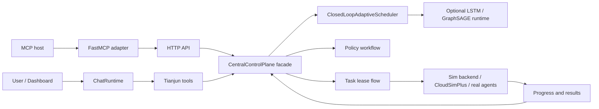

# Tianjun Engine

Tianjun Engine 是一个以本地优先的算网调度控制平面。它将自然语言需求对话、确定性多目标调度、可选的 ML 辅助预测、执行反馈、MCP 工具以及静态 Dashboard 整合为一个可运行的原型。

本项目用于研究、演示和架构实验，并非生产级云平台。资源清单、定价、拓扑和执行事实必须来自已注册的节点、仿真后端、CloudSimPlus 桥接器或真实节点代理；LLM 层可以进行解释和帮助解析意图，但不得在没有明确确认路径的情况下捏造控制平面事实或提交工作。

## 快速开始

需要 Python 3.10 或更新版本。

```powershell
python -m venv .venv
.\.venv\Scripts\Activate.ps1
python -m pip install --upgrade pip
python -m pip install -e ".[dev,mcp,ml-runtime]"
```

在不使用 LLM 的情况下运行控制平面：

```powershell
python -B main.py serve `
  --config configs\tianjun.example.toml `
  --offline `
  --default-execution-mode simulation `
  --host 127.0.0.1 `
  --port 8024
```

打开 Dashboard：

```text
http://127.0.0.1:8024/dashboard
```

验证服务：

```powershell
Invoke-RestMethod http://127.0.0.1:8024/health
Invoke-RestMethod http://127.0.0.1:8024/report
```

运行测试：

```powershell
python -m pytest
python scripts\smoke_test.py
```

Windows 用户也可以使用统一脚本入口：

```cmd
tianjun.bat start
tianjun.bat restart
tianjun.bat stop
tianjun.bat open
```

旧版 `start_tianjun.bat` 和 `restart_tianjun.bat` 包装脚本保留用于兼容。

## LLM 配置

离线模式是本地验证最安全的默认选项。要启用 OpenAI 兼容的 Hermes 聊天层，请将 API 密钥存储在仓库之外：

```powershell
python -B main.py secrets --config configs\tianjun.example.toml set deepseek --api-key "your_api_key_here"
python -B main.py llm-check --config configs\tianjun.example.toml
```

项目 `.env` 和 `DEEPSEEK_API_KEY` 也受支持，但桌面使用推荐使用本地密钥。

## 架构概览


```mermaid
flowchart LR
    User["User / Dashboard"] --> Chat["ChatRuntime"]
    MCP["MCP host"] --> MCPServer["FastMCP adapter"]
    Chat --> Tools["Tianjun tools"]
    MCPServer --> HTTP["HTTP API"]
    HTTP --> CP["CentralControlPlane facade"]
    Tools --> CP
    CP --> Scheduler["ClosedLoopAdaptiveScheduler"]
    CP --> Policy["Policy workflow"]
    CP --> Leases["Task lease flow"]
    Scheduler --> ML["Optional LSTM / GraphSAGE runtime"]
    Leases --> Agents["Sim backend / CloudSimPlus / real agents"]
    Agents --> Results["Progress and results"]
    Results --> CP
```

核心入口：

- CLI：`main.py` 或已安装的 `tianjun`
- HTTP 服务器：`src/tianjun/interfaces/http/server.py`
- Dashboard 资源：`src/tianjun/interfaces/dashboard/static/`
- 控制平面门面：`src/tianjun/application/control_plane.py`
- MCP 适配器：`src/tianjun/integrations/mcp_server.py`

## 文档

- [架构](docs/architecture.md)
- [HTTP API](docs/api.md)
- [弃用与遗留路由](docs/deprecation.md)
- [安全边界](docs/security-boundary.md)
- [DCI 实验与模型资产](docs/experiments-dci.md)
- [Dashboard 验证清单](docs/dashboard-test-checklist.md)
- [最终收敛冻结清单](docs/convergence-checklist.md)
- [文档索引](docs/README.md)

## 仓库布局

```text
main.py                         本地源码检出用 CLI 入口
pyproject.toml                  包元数据和依赖项扩展
configs/                        最小可运行配置模板
scripts/                        冒烟测试、训练辅助、Windows 辅助脚本
src/tianjun/application/        控制平面门面和应用服务
src/tianjun/chat/               Hermes 风格聊天运行时
src/tianjun/interfaces/http/    HTTP 服务器和遗留路由适配器
src/tianjun/interfaces/dashboard/static/
                                静态 HTML/CSS/JS Dashboard
src/tianjun/integrations/       MCP 集成
src/tianjun/scheduling/         确定性调度器
src/tianjun/policy/             需求解析、策略生成、反馈
data/trained_models/            可选的运行时模型制品和清单
data/dci_reference/             DCI 复现用研究数据
tests/                          单元、集成、契约和冒烟测试覆盖
```

## 兼容性

官方聊天流程为 `/chat/sessions`。较早的 `/intent`、`/chat`、`/hermes/chat` 和 `/hermes/chat/stream` 端点仍作为已弃用的兼容路由可用。新客户端不应依赖它们。

请参阅 [docs/deprecation.md](docs/deprecation.md) 获取迁移指导。
## Current Architecture Boundary

`CentralControlPlane` is now a facade and orchestration surface. Core business lifecycles live in application services:

- `NodeRegistry`: node registration and heartbeat lifecycle.
- `TaskLeaseService`: task submission, preview, scheduling, lease issue, and lease activation.
- `RequirementDialogueService`: requirement parsing and requirement-session lifecycle.
- `PolicyWorkflowService`: policy draft, option comparison, simulation, commit, feedback parsing, and feedback optimization.
- `src/tianjun/cli/commands/`: all CLI command handlers; `tianjun.cli` parses args, loads config, and dispatches.
