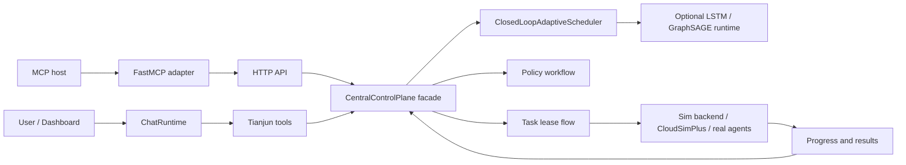

# Tianjun Engine

Tianjun Engine is a local-first compute-network scheduling control plane. It connects natural-language requirement dialogue, deterministic multi-objective scheduling, optional ML-assisted prediction, execution feedback, MCP tools, and a static Dashboard into one runnable prototype.

The project is intended for research, demos, and architecture experiments. It is not a production cloud platform. Inventory, pricing, topology, and execution facts must come from registered nodes, simulation backends, CloudSimPlus bridges, or real node agents; the LLM layer may explain and help parse intent, but it must not invent control-plane facts or commit work without an explicit confirmation path.

## Quick Start

Requires Python 3.10 or newer.

```powershell
python -m venv .venv
.\.venv\Scripts\Activate.ps1
python -m pip install --upgrade pip
python -m pip install -e ".[dev,mcp,ml-runtime]"
```

Run the control plane without an LLM:

```powershell
python -B main.py serve `
  --config configs\tianjun.example.toml `
  --offline `
  --default-execution-mode simulation `
  --host 127.0.0.1 `
  --port 8024
```

Open the Dashboard:

```text
http://127.0.0.1:8024/dashboard
```

Verify the service:

```powershell
Invoke-RestMethod http://127.0.0.1:8024/health
Invoke-RestMethod http://127.0.0.1:8024/report
```

Run tests:

```powershell
python -m pytest
python scripts\smoke_test.py
```

Windows users can also use the converged script entry:

```cmd
tianjun.bat start
tianjun.bat restart
tianjun.bat stop
tianjun.bat open
```

The legacy `start_tianjun.bat` and `restart_tianjun.bat` wrappers remain for compatibility.

## LLM Configuration

Offline mode is the safest default for local verification. To enable the OpenAI-compatible Hermes chat layer, store the API key outside the repository:

```powershell
python -B main.py secrets --config configs\tianjun.example.toml set deepseek --api-key "your_api_key_here"
python -B main.py llm-check --config configs\tianjun.example.toml
```

Project `.env` and `DEEPSEEK_API_KEY` are also supported, but local secrets are preferred for desktop use.

## Architecture At A Glance


```mermaid
flowchart LR
    User["User / Dashboard"] --> Chat["ChatRuntime"]
    MCP["MCP host"] --> MCPServer["FastMCP adapter"]
    Chat --> Tools["Tianjun tools"]
    MCPServer --> HTTP["HTTP API"]
    HTTP --> CP["CentralControlPlane facade"]
    Tools --> CP
    CP --> Scheduler["ClosedLoopAdaptiveScheduler"]
    CP --> Policy["Policy workflow"]
    CP --> Leases["Task lease flow"]
    Scheduler --> ML["Optional LSTM / GraphSAGE runtime"]
    Leases --> Agents["Sim backend / CloudSimPlus / real agents"]
    Agents --> Results["Progress and results"]
    Results --> CP
```

Core entry points:

- CLI: `main.py` or installed `tianjun`
- HTTP server: `src/tianjun/interfaces/http/server.py`
- Dashboard assets: `src/tianjun/interfaces/dashboard/static/`
- Control-plane facade: `src/tianjun/application/control_plane.py`
- MCP adapter: `src/tianjun/integrations/mcp_server.py`

## Documentation

- [Architecture](docs/architecture.md)
- [HTTP API](docs/api.md)
- [Deprecation and legacy routes](docs/deprecation.md)
- [Security boundary](docs/security-boundary.md)
- [DCI experiments and model assets](docs/experiments-dci.md)
- [Dashboard validation checklist](docs/dashboard-test-checklist.md)
- [Documentation index](docs/README.md)

## Repository Layout

```text
main.py                         CLI shim for local source checkout
pyproject.toml                  package metadata and dependency extras
configs/                        minimal runnable configuration templates
scripts/                        smoke tests, training helpers, Windows helpers
src/tianjun/application/        control-plane facade and application services
src/tianjun/chat/               Hermes-style chat runtime
src/tianjun/interfaces/http/    HTTP server and legacy route adapter
src/tianjun/interfaces/dashboard/static/
                                static HTML/CSS/JS Dashboard
src/tianjun/integrations/       MCP integration
src/tianjun/scheduling/         deterministic scheduler
src/tianjun/policy/             requirement parsing, policy generation, feedback
data/trained_models/            optional runtime model artifacts and manifest
data/dci_reference/             research data for DCI reproduction
tests/                          unit, integration, contract, and smoke coverage
```

## Compatibility

The official chat flow is `/chat/sessions`. The older `/intent`, `/chat`, `/hermes/chat`, and `/hermes/chat/stream` endpoints are still available as deprecated compatibility routes. New clients should not depend on them.

See [docs/deprecation.md](docs/deprecation.md) for migration guidance.
